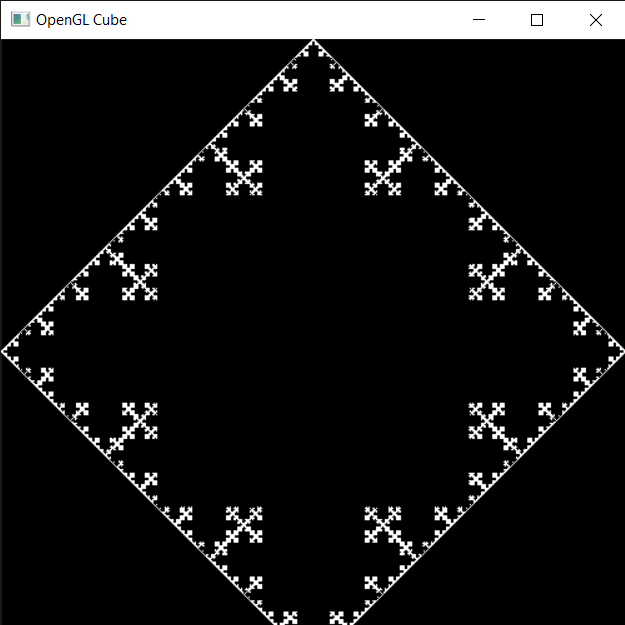
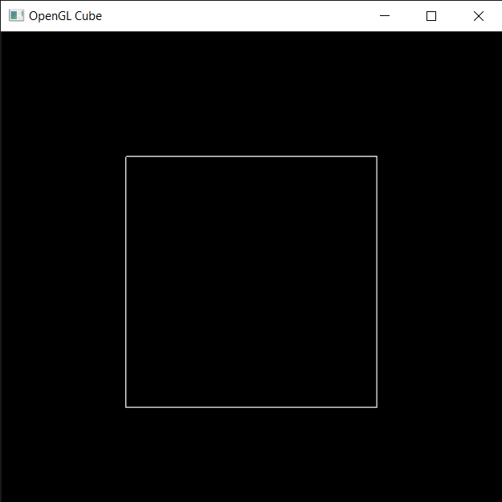
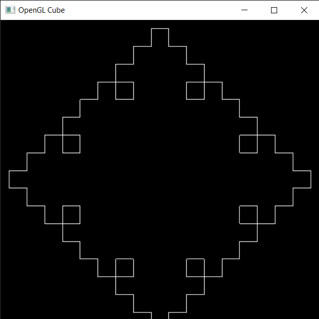

# square_fractals_openGL
Subdivision of square into fractals 
```
press + to increase the subdivision
press - to decrease the subdivision
```
### 1.1 Square Fractals

Given a initial square, subdivide each side of square such that a square of side
one third of original square. The approach is to store each vertex in order and
render them in sequence. There are two structs used Vertex that stores x,y
coordinates of a vertex and another struct Edges that contains two consecutive
vertex coordinates and orientation which basically tells the orientation of the
edge, this will be useful to calculate new edges new small squares form outside
of original edge.

Vertex and Edges.
```cpp
structVertex{
  glm::vec2 v;
};


structEdges{
  glm::vec2 first ;
  glm::vec2 second;
  char orientation;
};
```
The class Pol contains several methods and variables to store the new vertices
whenever a object is creates, later whenever the current polygon is subdivided
a new Pol object will be formed that will store all edges in sequence.

##### Data Types
  - std::vector< Edges >edge- this vector will store all the edges
    in sequence. As mentioned above an edge contains two vertices and
    orientation.


- std::vector< V ertex >vertex;- this vector stores all the vertices
    in current polygon in sequence
- float len- it stores the side length of current polygon.
##### Constructors
- Default Constructors Pol() - it will construct a 2D square and
store all call the method construct that will calculate edges and store
them,
- Parameterized Constructors Pol(std::vector< V ertex >v,
float l) - it will construct polygon based on the vector v passed
that should contain all the vertices in order, it also calls construct
that will calculate edges and store them. It also stores the length of
square side.
##### Methods
- construct()- this method will fill the edge vector using the vertex
vector passed to constructor
- findorient()- this method will find the orientation of each edge
using 2 vertices and coordinate geometry. Orientation is necessary
to find new edges while subdividing the square. it will return a char
which represents the edge orientation. Since all the edges can have
only four orientations,
∗’a’ represents right edge of square.
∗’b’ represents bottom edge of square.
∗’c’ represents left edge of square.
∗’d’ represents top edge of square.

Pol definations
```cpp
Pol :: Pol(){
  Vertex ver [4];
  ver [0]. v ={1,1};
  vertex. pushback(ver[0]) ;
  ver [1]. v ={1,− 1 };
  vertex. pushback(ver[1]) ;
  ver [2]. v ={ −1,− 1 };
  vertex. pushback(ver[2]) ;
  ver [3]. v ={ −1, 1};
  vertex. pushback(ver[3]) ;
  len = 2.0;
  std :: cout<<vertex.size()<<std::endl;
  construct() ;
}

Pol :: Pol(std :: vector<Vertex>v,floatl){
  vertex = v;
  len = l;
  construct() ;
  std :: cout<<edge.size()<<” ”<<vertex.size()<<std::endl;
}

voidPol::construct(){
  std :: vector<Vertex>::iterator i ;
  for( i = vertex.begin(); i != vertex.end()−1; ++i)
   {
      Vertex first =∗i;
      Vertex second =∗(i + 1);
      Edges temp;
      temp. first = first. v;
      temp.second = second.v;
      temp.orientation = findorient ( first. v, second.v);
      edge.pushback(temp);
    }
  Edges temp;
  temp. first = (vertex.back()).v;
  temp.second = (vertex.front()). v;
  temp.orientation = findorient ((vertex. back()).v, (vertex. front () ). v);
  edge.pushback(temp);
}

charPol:: findorient (glm::vec2 a, glm::vec2 b){
  if (a.x == b.x && a.y>b.y)return’a’;
  else if (a.y == b.y && a.x>b.x)return’b’;
  else if (a.x == b.x && a.y<b.y)return’c’;
  else return’d’;
}
```

#### 1.1.1 Source.cpp

There are three global variables a vector listofpols that contains Pol objects
hence the ploygons, curr is a Pol object that refers to the current polygon that
is being drawn on screen. curpointer is a integer that keeps track of index of
Pol object in listofpols and is used to iterate back and fourth over listofpols.
When user presses the key ’+’ divide() function is called which makes a new
polygon based on current polygon edges and orientation of each edge and adds
the Polygon to listofpols as well as making the curr point to new polygon.
When user presses the key ’-’ back() function is called which simply moves
the curr pointer one index back in listofpols.



Figure 1.1: Square




Figure 1.2: Making fractals
